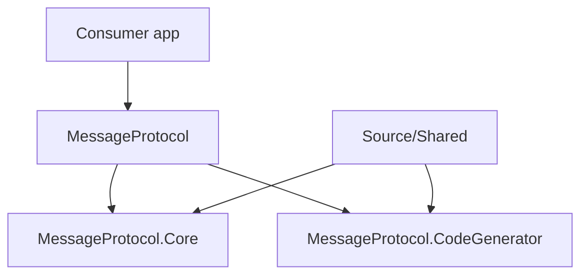

# Architecture Overview

Core(런타임) + CodeGenerator(컴파일 타임) + MessageProtocol(통합 패키지) 3층. 앱은 보통 MessageProtocol만 참조한다.

## 저장소 레이아웃

| 경로 | 역할 |
| ------ | ------ |
| `Source/` | 제품 코드: Core, CodeGenerator, MessageProtocol, Shared |
| `Test/` | MessageProtocol.Tests (xUnit, net8.0;net9.0), Benchmarks (net9.0) |
| `Sandbox/` | 실행 가능 인수 조건 (시나리오 통과 시 종료 코드 0) |
| `Document/` | Obsidian vault (이 문서) |
| `Legacy/` | v1 참조 구현 + 구 문서 (수정 금지) |
| `MessageProtocol.sln` | 솔루션 |

```text
Source/
├── Directory.Build.props          # packable, netstandard2.1 기본, Version 2.0.0
├── Shared/                        # Core+Generator Link Compile
│   ├── MessageFlag.cs
│   └── MessageWireFormat.cs
├── MessageProtocol.Core/          # 런타임 NuGet (netstandard2.1;net6.0)
├── MessageProtocol.CodeGenerator/ # Roslyn 생성기 NuGet (netstandard2.0)
└── MessageProtocol/               # 통합 meta 패키지
```

## 다이어그램



| 층 | 시점 | 역할 |
| ---- | ------ | ------ |
| **MessageProtocol** | 패키지 참조 | Core 런타임 DLL + CodeGenerator를 analyzer로 묶음 |
| **MessageProtocol.Core** | 런타임 | `MessageSerializer`, 메시지 속성·계약, 버퍼 I/O |
| **MessageProtocol.CodeGenerator** | 컴파일 | 속성 스캔 → Serialize/Deserialize/MessageId + ModuleInitializer |

## 주요 원칙

- 소비 앱은 **MessageProtocol**만 참조하면 된다.
- `Source/Shared`의 와이어 상수(`MessageFlag`, `MessageWireFormat`)는 Core와 Generator에 **Link Compile**되어 헤더 규칙이 단일 소스에서 온다. 생성기 빌드에서는 `MESSAGE_PROTOCOL_CODE_GENERATOR` 상수로 internal 가시성이 된다.
- 메시지 타입은 속성 + `partial`로 선언하고, 생성 코드가 `[ModuleInitializer]`로 `MessageSerializer`에 자동 등록한다.
- 네트워크 전송·RPC는 범위 밖 → [Feature-Spec](./Feature-Spec.md) "범위 밖".

## 관련

- [Feature-Spec](./Feature-Spec.md)
- [Packages](../03-Reference/Packages.md)
- [CONTEXT](../00-AI/CONTEXT.md)
