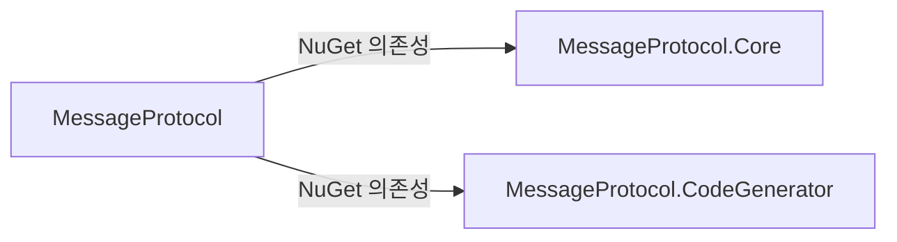

# Packages

버전 3.2.0 (재작성 버전. 패키지 아이디는 v1과 동일).

| NuGet 패키지 | 프로젝트 경로 | TFM | 설명 |
| -------------- | --------------- | ----- | ------ |
| **MessageProtocol** | `Source/MessageProtocol/` | netstandard2.1 | 메인 패키지. Core 런타임 + CodeGenerator 를 NuGet 의존성으로 함께 설치 |
| **MessageProtocol.Core** | `Source/MessageProtocol.Core/` | netstandard2.1; net6.0 | 직렬화 런타임 API |
| **MessageProtocol.CodeGenerator** | `Source/MessageProtocol.CodeGenerator/` | netstandard2.0 | Roslyn 분석기/소스 생성기 (고급·세분화 참조용) |

## 설치

```bash
dotnet add package MessageProtocol
```

코어만:

```bash
dotnet add package MessageProtocol.Core
```

## 패키지 관계



| 참조 | 방식 |
| ------ | ------ |
| MessageProtocol → Core | 일반 `ProjectReference` → nuspec 의존성 (`MessageProtocol.Core`) |
| MessageProtocol → CodeGenerator | `OutputItemType=Analyzer` `ProjectReference` → nuspec 의존성 (`MessageProtocol.CodeGenerator`). `ReferenceOutputAssembly=false` 를 붙이면 NuGet pack 이 의존성을 만들지 않는다(실증, 2026-09-13) |
| MessageProtocol pack | 메타 패키지 — 런타임 DLL만 `lib/`, CodeGenerator는 의존성으로 전파 (기존 `analyzers/dotnet/cs` 동봉 제거) |
| CodeGenerator pack | `IncludeBuildOutput=false`, analyzer DLL만 `analyzers/dotnet/cs` |
| Shared | Core·Generator 모두 `Compile Include` + Link (`MESSAGE_PROTOCOL_CODE_GENERATOR` 상수로 생성기 측 internal) |

**단일 설치 검증(2026-09-13)**: 로컬 피드에서 `MessageProtocol` 만 설치한 소비자 프로젝트에서 ① 복원 그래프(`project.assets.json`)에 `MessageProtocol.Core`·`MessageProtocol.CodeGenerator` 모두 포함 ② 생성기 전용 static 멤버(`MessageId`) 참조 컴파일 성공 → 소스 생성기가 의존성 경로로 정상 전파됨을 확인. 주의: PackTask 는 ProjectReference 유래 의존성에 `exclude="Build,Analyzers"` 를 강제로 붙이지만, 전이(transitive) 소스 생성기 적용은 막지 않는다(실증).

## 버전·빌드 구성

- 패키지 Version은 `Source/Directory.Build.props`에서 중앙 관리 (현재 `3.2.0`).
- 루트 `Directory.Build.props` → 기본 `IsPackable=false` (Test·Sandbox 등), `**/generated-out/**` 컴파일 제외 가드.
- 솔루션 수준 `dotnet build -t:Rebuild` 는 간헐적으로 **CS0006 2건**(분석기 참조 DLL 을 Clean 이 지운 뒤 소비자 CSC 가 못 찾음)을 낸다 — 재현이 불안정한 도구 체인 특성이라 경고 센서스는 솔루션 Rebuild 대신 **프로젝트별로 의존 순서대로 `-t:Rebuild`** 를 도는 쪽을 쓴다.
- 팩 검증: `dotnet pack MessageProtocol.sln -c Release -o artifacts/packages`.
- **Unity 호환 (3.2.0 부터 기본 빌드)** — Unity 6.0(6000.0.x) 에디터가 번들한 Roslyn 은 4.3.0 이다. 생성기가 그보다 새 Roslyn(≤3.1.0 시절 4.14)을 참조하면 CS9057 로 조용히 스킵된다(컴파일은 되지만 생성 코드가 없어 이후 실패). 3.2.0 부터 `Source/Directory.Build.props` 의 `RoslynAnalyzerApiVersion`(기본 **4.3.0**)으로 기본 빌드·CI·nuget.org 게시물 자체가 Unity 호환이다 — 구 Roslyn 참조는 상위 컴파일러(4.14 포함 최신 SDK)에서도 하위호환 동작하므로 단일 패키지로 Unity·.NET 양쪽을 커버한다. 검증(2026-09-14): 3.2.0 nupkg 내부 DLL netstandard2.0·AssemblyRef Microsoft.CodeAnalysis(CSharp) 4.3.0.0(System.Reflection.Metadata), 기본 경로 경고 0(4.3 번들 분석기의 RS1024 오탐은 MessageCodeGenerator.cs 파일 스코프 `#pragma warning disable RS1024` 억제 — NamedTypeSymbolComparer 는 SymbolEqualityComparer 위임). 참고: `-unity` 접미사 변형(3.1.0-unity, 로컬 피드 낙구)은 이 정책 전환 전 유물로 폴백용으로만 남는다.
- **발행 후 실재 확인(2026-09-09 절차 추가)**: Actions 성공("Your package was pushed")은 업로드 *수락*만 뜻한다 — nuget.org 의 검증·색인 전파(수십 분~수 시간)가 끝나야 소비자가 볼 수 있다. 완료 판정: `https://api.nuget.org/v3-flatcontainer/{id}/index.json` 에 신규 버전이 나열되고 **직접 nupkg GET 이 200** 인지 확인한 뒤 릴리스를 종결한다. (2.3.1·2.3.9 에서 관측: 푸시 직후 색인에 없음·직접 GET 404 — 이 시차 동안 소비자 복원은 NU1102. 소비자 이행 검증 명령은 PENDING.md 참조.)
- **아티팩트 실물 검증(2026-09-08, 2.3.5)** — nupkg 압축 해제 확인: `MessageProtocol` — 런타임 DLL(`lib/netstandard2.1`)·분석기 DLL(`analyzers/dotnet/cs`)·README·XML 문서 포함, 의존성 `MessageProtocol.Core 2.3.5`. `MessageProtocol.Core` — `lib/netstandard2.1` + `lib/net6.0` 이중(유일한 `#if` 는 ModuleInitializer 폴백 — net6.0 에서 컴파일 아웃, 이중 TFM 의 존재 이유). 파사드가 NS2.1 단일인 것은 의도(Core net6.0 자산은 직접 참조 소비자용).
- 분석기 릴리스 추적: `Source/MessageProtocol.CodeGenerator/AnalyzerReleases.Shipped.md`(릴리스된 규칙) · `AnalyzerReleases.Unshipped.md`(차기 릴리스 대기 규칙). SDK 가 두 파일을 자동으로 `AdditionalFiles` 에 포함하므로 csproj 에 중복 선언하지 않는다. **새 진단 규칙을 추가하면 반드시 `AnalyzerReleases.Unshipped.md` 에 `Rule ID | Category | Severity | Notes` 행을 추가** — 누락 시 RS2008 경고(증분 빌드에서는 가려지고 클린 빌드에서만 노출). 파일 형식은 엄격하다: 구분 행은 `--------|----------|----------|-------` 처럼 파이프 주변 공백 없이 써야 하며, 공백이 섞이면 RS2007(잘못된 릴리스 헤더) 경고가 난다.

## 관련

- [Public-API](./Public-API.md)
- [Overview](../02-Architecture/Overview.md)
